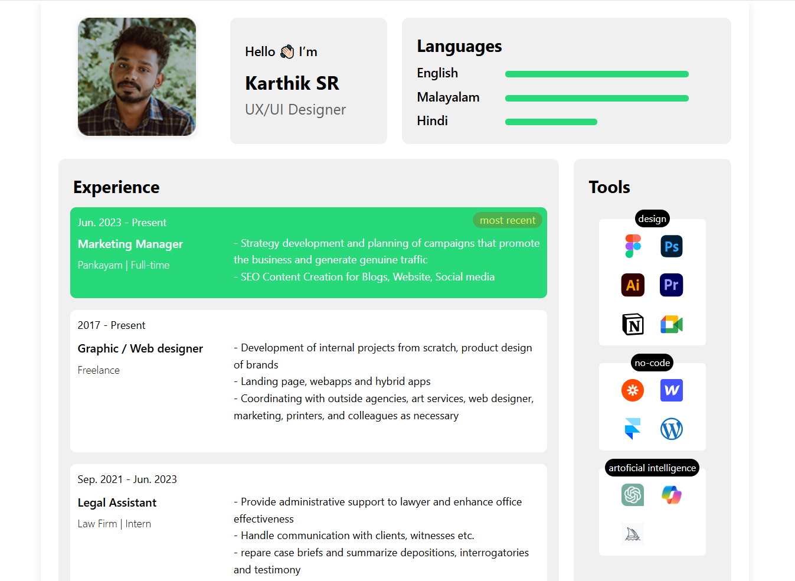

# PDF Resume Maker

[](https://sw1ftfox.github.io/pdf-resume-maker/)

Интерактивное веб-приложение для создания и редактирования профессионального резюме с возможностью экспорта в PDF.



## ✨ Особенности

- **Редактирование в реальном времени** - изменяйте любой текст резюме прямо на странице
- **Автосохранение** - все изменения сохраняются в браузере (localStorage)
- **Экспорт в PDF** - скачивайте актуальную версию резюме одним кликом
- **Адаптивный дизайн** - корректное отображение на любых устройствах
- **CSS-анимации** - плавные визуальные эффекты при взаимодействии

## 🛠 Технологии

- HTML5
- CSS3 (Grid, Flexbox, CSS Variables)
- JavaScript (ES6)
- [html2pdf.js](https://github.com/eKoopmans/html2pdf.js) - для генерации PDF
- [Vite](https://vitejs.dev/) - инструмент сборки

## 🚀 Быстрый старт

1. **Клонируйте репозиторий**:

```bash
git clone https://github.com/sw1ftfox/pdf-resume-maker.git
cd pdf-resume-maker
```

2. **Установите зависимости**:

```
npm install
```

3. **Запустите приложение**:

```
npm run dev
```

4. **Откройте в браузере**:

```
http://localhost:5173/pdf-resume-maker/
```

## 📁 Структура проекта

```diff
+ src/
+ ├── assets/                    # Изображения и иконки
+ │   ├── icons/                 # Иконки
+ │   ├── imgs/                  # Изображения
+ ├── css/                       # Стили
+ │   ├── components/            # Стили компонентов
+ │   ├── main.css               # Основные стили
+ │   ├── resume-container.css   # Стили контейнера с резюме
+ │   ├── animations.css         # Анимации
+ │   ├── media.css              # Стили адаптивности
+ │   └── ...                    # Другие стили
+ ├── js/                        # JavaScript логика
+ │   ├── editor.js              # Редактирование контента
+ │   ├── double-click.js        # Изменение классов по двойному клику
+ │   └── pdf-export.js          # Экспорт в PDF
+ └── main.js                    # Точка входа
+ index.html                     # Основной HTML файл
+ package.json                   # Зависимости проекта
+ README.md                      # Этот файл
```

## 🧩 Основные функции

### Редактирование контента

Кликните на любой текстовый элемент резюме, чтобы редактировать его. Изменения автоматически сохраняются в localStorage.

### Экспорт в PDF

Нажмите кнопку "Download PDF" внизу страницы, чтобы скачать текущую версию резюме в формате PDF.

### Адаптивность

Резюме автоматически адаптируется под:

- Мобильные устройства (до 768px)
- Планшеты (768px-1024px)
- Десктопы (1024px+)

## 📝 Настройка контента

Чтобы изменить начальное содержание резюме, отредактируйте соответствующие элементы в `index.html`:

```html
<!-- Пример изменения имени -->
<h1 class="editable" data-id="name">Ваше Имя</h1>

<!-- Пример изменения должности -->
<h2 class="editable" data-id="title">Ваша Должность</h2>
```
